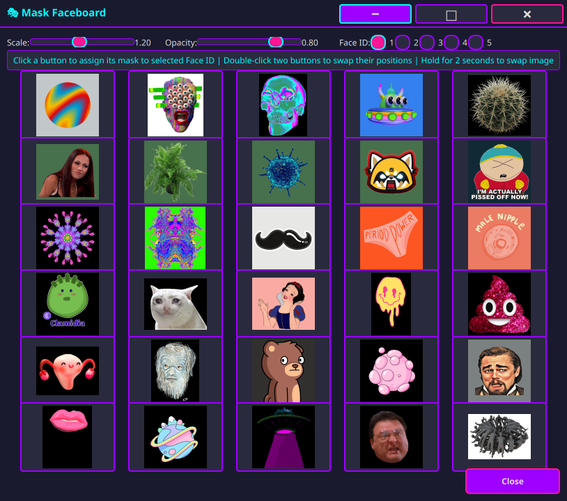
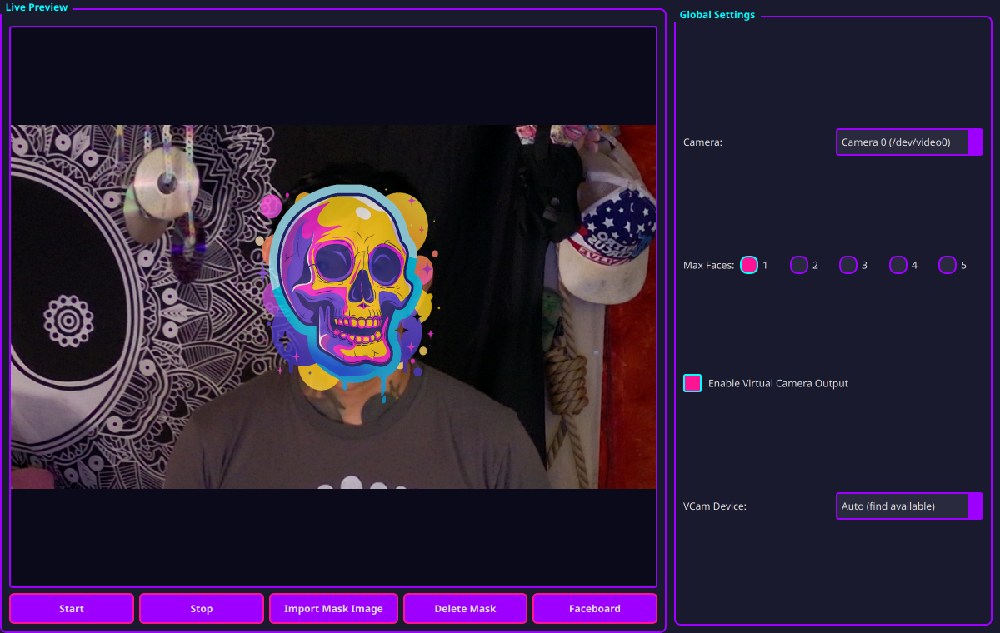

# Faceboard Nova

Real-time face detection and augmented reality masking with virtual camera output. Track up to 5 faces with persistent identity, assign masks per face, and pipe to OBS or any streaming software.


***

## 🎭 Overview

**Faceboard Nova** is a real-time augmented reality face mask application built for Linux creators, streamers, and developers who need precise, identity-aware face augmentation with virtual camera output.

Whether you're protecting anonymity in live streams, building immersive interactive experiences, creating surreal content for social media, or just want to be a sentient pineapple during your team meeting—Faceboard Nova handles it with frame-accurate tracking, persistent identity recognition, and seamless virtual camera integration.

But beyond the fun, this tool addresses real needs: **privacy-preserving livestreaming**, **identity protection for sensitive broadcasts**, **augmented storytelling for creators**, and **accessible real-time face manipulation without cloud dependencies or subscriptions**. You own your masks, you control your data, and the entire pipeline runs locally on your machine.

***

## ✨ Features

### Core Functionality

- **Real-time Face Detection**: Uses MediaPipe Face Mesh for accurate, fast face detection (468 landmark points)
- **Multiple Face Support**: Track and mask up to 5 faces simultaneously
- **Persistent Identity Recognition**: Remembers faces across frames and automatically reassigns masks when detected again
- **Partial Face Detection**: Detects faces even when partially visible (as little as 10% of key landmarks)
- **Off-screen Tracking**: Continues tracking faces that move partially or fully off-screen for up to 3-6 seconds


### Mask Features

- **Multiple Format Support**: PNG, JPG, and animated GIF masks
- **Animated GIF Support**: Full support for animated GIF masks with proper frame timing and looping
- **Transparent Backgrounds**: PNG masks with alpha channels; masks can extend beyond frame boundaries
- **Per-Face Customization**: Each face has independent mask, scale, and opacity settings
- **Real-time Adjustment**: Adjust scale (0.5x–2.0x), opacity (0%–100%), and enable/disable masks in real-time
- **Mask Library Management**: Import, delete, and organize masks through the GUI


### Advanced Features

- **Face Identity System**: Advanced face recognition using normalized facial landmarks and cosine similarity matching
- **Greedy Matching Algorithm**: Ensures each identity is matched to only one face per frame
- **Exponential Smoothing**: Smooth face tracking with configurable smoothing factor for stable mask placement
- **Head Rotation Compensation**: Masks automatically rotate and scale to match head tilt and orientation
- **Virtual Camera Output**: Direct v4l2loopback support with fallback to pyvirtualcam
- **OBS Integration**: Designed to work seamlessly alongside OBS Virtual Camera without device conflicts


### User Interface

- **Faceboard Window**: Visual interface for assigning masks to detected faces


- **Real-time Preview**: Live preview of masked video feed
- **Camera Selection**: Choose from available cameras
- **Virtual Camera Device Selection**: Manually select or auto-detect virtual camera devices (auto-excludes `/dev/video9` to avoid OBS conflicts)

***

## 🎨 Use Cases

### For Fun

- **Become anyone (or anything)**: Swap faces with friends, historical figures, or your cat
- **Animated chaos**: Apply animated GIF masks that loop in sync with your movements
- **Surreal streams**: Create impossible visual experiences—float eyeballs, recursive faces, glitch art
- **Collaborative performance**: Assign different masks to multiple people in the frame for synchronized visual storytelling


### For Serious Work

- **Privacy protection**: Mask faces in sensitive interviews, whistleblower streams, or activist broadcasts without sacrificing live engagement
- **Identity obfuscation**: Protect identities during online meetings, therapy sessions, or legal consultations
- **Creative production**: Augment live video performances, theater, or educational content with real-time character masks
- **Accessibility**: Enable creators with privacy concerns or personal safety needs to participate in live video culture without exposing their identity

***

## 📋 Requirements

### System Requirements

- **OS**: Linux (tested on Ubuntu/Debian-based distributions and Pop!_OS)
- **Python**: 3.8 or higher
- **Webcam**: Any USB webcam or built-in camera
- **Virtual Camera**: v4l2loopback kernel module (for Linux virtual camera support)


### Python Dependencies

- `opencv-python` (cv2) – Video capture and processing
- `numpy` – Numerical operations
- `mediapipe` – Face detection and landmark tracking
- `Pillow` (PIL) – Image processing and GIF support
- `PyQt5` – GUI framework
- `pyvirtualcam` (optional) – Fallback virtual camera support

***

## 🚀 Installation

### Quick Install (One Command)

The installation script handles **everything** automatically:

```bash
# Clone the repository
git clone https://github.com/platysonique/FaceboardNova.git
cd FaceboardNova

# Run the install script - it handles everything!
bash install.sh
```

**That's it!** The install script will:

1. ✅ **Check Python installation** (requires Python 3.8+)
2. ✅ **Create virtual environment** (if it doesn't exist)
3. ✅ **Install Python dependencies** (opencv-python, numpy, mediapipe, Pillow, PyQt5, pyvirtualcam)
4. ✅ **Check/install system dependencies** (v4l2loopback, v4l-utils) - with prompts
5. ✅ **Set up virtual camera devices** (with prompts for user confirmation)
6. ✅ **Create `fbnova` command** (allows launching from anywhere)
7. ✅ **Create masks directory** (ready for your mask images)
8. ✅ **Add PATH to shell config** (if needed and user confirms)

After installation, simply run:
```bash
fbnova
```



**Note**: The script will prompt you for:
- Installing v4l2loopback (if not found) - requires sudo
- Setting up virtual camera devices - requires sudo and OBS Virtual Camera must be stopped
- Adding PATH to shell config (optional)

### Manual Installation (Advanced Users)

If you prefer to install dependencies manually or the automated script doesn't work for your system:

#### 1. Clone the Repository

```bash
cd /path/to/your/projects
git clone https://github.com/platysonique/FaceboardNova.git
cd FaceboardNova
```

#### 2. Install System Dependencies

##### Install v4l2loopback (Virtual Camera Support)

```bash
# Ubuntu/Debian/Pop!_OS
sudo apt-get update
sudo apt-get install v4l2loopback-dkms v4l-utils

# Verify installation
modinfo v4l2loopback
```


##### Install Python Dependencies

```bash
# Create virtual environment (recommended)
python3 -m venv venv
source venv/bin/activate

# Install required packages
pip install opencv-python numpy mediapipe Pillow PyQt5 pyvirtualcam
```


#### 3. Set Up Virtual Camera Devices

The application needs separate virtual camera devices to avoid conflicts with OBS Virtual Camera. Run the setup script:

```bash
bash fix_vcam_conflict.sh
```

This script will:

- Check for existing v4l2loopback devices
- Create 5 devices: `/dev/video9` (reserved for OBS) and `/dev/video10-13` (for Faceboard Nova)
- Verify device creation

**Important**: Stop OBS Virtual Camera before running this script!

#### 4. Create Command Launcher

To create a `fbnova` command that can be run from anywhere:

```bash
bash install.sh
```

This will:
- Create a `fbnova` command in `~/.local/bin` (or `/usr/local/bin` if needed)
- Allow you to launch Faceboard Nova from any directory by typing `fbnova`
- Automatically activate the virtual environment if it exists

**Note**: If `~/.local/bin` is not in your PATH, add this to your `~/.bashrc` or `~/.zshrc`:
```bash
export PATH="$HOME/.local/bin:$PATH"
```
Then restart your terminal or run `source ~/.bashrc`.

### Add Your Masks

**Important**: Faceboard Nova does **NOT** come with masks. You must provide your own mask images.

**Supported File Types**:

- **PNG** (recommended) – Supports transparency via alpha channel
- **JPG/JPEG** – Standard image format
- **GIF** – Supports both static and animated masks

Place your mask images in the `masks/` directory:

```bash
# Create masks directory if it doesn't exist
mkdir -p masks

# Copy your mask files
cp your_mask.png masks/
cp your_animated_mask.gif masks/
cp your_mask.jpg masks/
```

**Mask Requirements**:

- Masks should have transparent backgrounds (PNG with alpha channel) for best results
- Recommended size: 512×512 to 1024×1024 pixels
- Square aspect ratio works best (will be scaled to face size)
- Animated GIFs are fully supported with proper frame timing

***

## 🎮 Usage

### Starting the Application

#### Option 1: Using the Command (if installed)

If you ran `install.sh`, you can launch from anywhere:

```bash
fbnova
```

#### Option 2: Using the Launcher Script

```bash
./run_gui.sh
```

#### Option 3: Direct Python Execution

```bash
# Activate virtual environment if using one
source venv/bin/activate

# Run the application
python3 ar_face_masks_gui.py
```


### Basic Workflow

1. **Start Processing**: Click "Start" button to begin face detection
2. **Assign Masks**:
    - Click "Open Faceboard" to open the mask assignment window
    - Select a mask from the grid and assign it to a face (Face 1–5)
3. **Adjust Settings**: Use sliders in the Faceboard window to adjust scale and opacity for each face
4. **Use in Streaming Software**: Select "Faceboard Nova" or your configured virtual camera device as a video source in OBS, Zoom, Discord, or any application that supports virtual cameras

### Faceboard Window

The Faceboard provides a visual interface for mask assignment. To open it, click the **"Open Faceboard"** button in the main window.

#### How to Use the Faceboard:

1. **View Available Masks**:
    - All masks in the `masks/` directory are displayed as thumbnails in a grid
    - Masks are automatically loaded when the application starts
    - Animated GIFs show their first frame as the thumbnail
2. **Assign Masks to Faces**:
    - **Method 1**: Select a Face ID using the radio buttons at the top (Face 1–5), then click any mask thumbnail button to assign it to that face
    - **Method 2**: Click a mask thumbnail button first, then click a Face ID radio button to assign the selected mask
    - The assigned mask will be applied immediately and visible in the live preview
    - The mask button will be highlighted to show which mask is assigned to each face
3. **Swap Button Positions**:
    - **Double-click** the first mask button you want to swap (it will highlight in cyan)
    - **Double-click** a second mask button to swap their positions in the grid
    - This reorganizes your mask library without changing assignments
4. **Swap Mask Images**:
    - **Hold** a mask button for 2 seconds to open the Image Swap window
    - Select a replacement mask from the visual library
    - The button will update with the new mask image
5. **Import New Masks**:
    - Click the **"Import Mask"** button
    - Select a PNG, JPG, or GIF file from your file system
    - The mask will be copied to the `masks/` directory and appear in the grid
    - Supported formats: `.png`, `.jpg`, `.jpeg`, `.gif`
6. **Delete Masks**:
    - Right-click on a mask thumbnail in the grid
    - Select "Delete" from the context menu
    - Confirm deletion (this permanently removes the file from the `masks/` directory)
7. **View Assigned Masks**:
    - Face number buttons show which mask is currently assigned to each face
    - The assigned mask thumbnail will be highlighted in the grid
    - You can reassign masks at any time by selecting a different mask and clicking a face number

**Tips**:

- The Faceboard window can stay open while you use the main application
- Changes take effect immediately—you'll see masks applied in real-time
- You can assign the same mask to multiple faces if desired
- Face identities are remembered during the current session: once assigned, masks will automatically reapply when the same face is detected again (within the same session)


### Per-Face Controls

Each detected face has independent controls in the **Faceboard window**:

- **Face ID Selection**: Radio buttons to select which face you're configuring (Face 1–5)
- **Scale Slider**: Adjust mask size (0.5× to 2.0×) - displayed as percentage (50–200%)
- **Opacity Slider**: Adjust mask transparency (0% to 100%)
- **Mask Assignment**: Click mask buttons in the grid to assign to the selected Face ID

**Note**: Per-face controls are located in the Faceboard window, not the main window. The main window only provides camera selection, virtual camera settings, and the preview.

***

## ⚙️ Configuration

### Virtual Camera Settings

- **Enable Virtual Camera Output**: Toggle virtual camera output on/off
- **Device Selection**: Choose a specific device or use auto-detection
- **Auto-detection**: Automatically finds available v4l2loopback devices (video10+) and avoids conflicts with OBS (video9)


### Face Detection Settings

The application uses optimized settings for fast, robust detection:

- **Detection Confidence**: 0.3 (detects faces with minimal visibility)
- **Tracking Confidence**: 0.3 (maintains tracking with partial visibility)
- **Max Faces**: 5 (configurable in code)
- **Partial Visibility Threshold**: 10% of key landmarks required


### Advanced Settings (Code-Level)

Key parameters in `ar_face_masks_gui.py`:

- `max_faces`: Maximum number of faces to track (default parameter: 3, but UI default: 5)
- `tracking_threshold`: Distance threshold for face matching (default: 0.25)
- `identity_match_threshold`: Face recognition threshold (default: 0.4)
- `min_detection_confidence`: MediaPipe detection confidence (default: 0.3)
- `min_tracking_confidence`: MediaPipe tracking confidence (default: 0.3)

***

## 🔧 Troubleshooting

### Virtual Camera Issues

**Problem**: No virtual camera devices found

**Solution**:

1. Run `bash fix_vcam_conflict.sh` to create devices
2. Verify devices exist: `ls -la /dev/video{9..13}`
3. Check v4l2loopback is loaded: `lsmod | grep v4l2loopback`

**Problem**: Conflict with OBS Virtual Camera

**Solution**:

- OBS always uses `/dev/video9` (first device)
- Faceboard Nova uses `/dev/video10+` (automatically excludes video9)
- Both can run simultaneously if devices are set up correctly
- See `QUICK_FIX.md` for detailed instructions

**Problem**: "Device is busy" error

**Solution**:

1. Stop OBS Virtual Camera
2. Stop Faceboard Nova application
3. Unload module: `sudo modprobe -r v4l2loopback`
4. Reload with proper devices: `bash fix_vcam_conflict.sh`

### Face Detection Issues

**Problem**: Faces not detected

**Solution**:

- Ensure good lighting
- Face the camera directly
- Check camera permissions
- Verify MediaPipe is installed correctly

**Problem**: Wrong mask assigned to face

**Solution**:

- The identity system learns faces over time
- Manually reassign the mask using the Faceboard
- The system will remember the new assignment

**Problem**: Masks flickering or jumping

**Solution**:

- This is normal during initial detection
- Masks stabilize after a few frames
- Adjust tracking threshold in code if needed


### Performance Issues

**Problem**: High CPU usage

**Solution**:

- Reduce number of faces tracked (`max_faces`)
- Use smaller mask images
- Close other applications
- Lower camera resolution in settings

**Problem**: Lag or delay

**Solution**:

- Check camera FPS settings
- Reduce mask complexity (smaller images, fewer animated frames)
- Ensure sufficient CPU resources

***

## 📁 Project Structure

```
FaceboardNova/
├── ar_face_masks_gui.py      # Main application file
├── run_gui.sh                # Launcher script
├── install.sh                # Install script (creates 'fbnova' command)
├── fix_vcam_conflict.sh      # Virtual camera setup script
├── QUICK_FIX.md              # Quick troubleshooting guide
├── Faceboard Nova.md         # This file (main README)
├── LICENSE                   # MIT License
├── .gitignore                # Git ignore rules
├── masks/                    # Mask images directory (user-provided, not in repo)
│   └── (your mask files go here)
├── filters/                  # Reserved for future filters
└── venv/                    # Virtual environment (not in repo)
```


***

## 🏗️ Architecture

### Core Components

1. **VideoProcessor (QThread)**
    - Handles video capture and processing
    - Face detection using MediaPipe Face Mesh
    - Mask application and rendering with affine transformations
    - Virtual camera output via v4l2loopback or pyvirtualcam
2. **MainWindow (QMainWindow)**
    - Main GUI window with PyQt5
    - Camera and virtual camera device selection
    - Real-time preview display
    - Button to open Faceboard window
3. **FaceboardWindow (QDialog)**
    - Visual mask assignment interface
    - Per-face controls (scale, opacity, Face ID selection)
    - Mask library management (import, delete, organize)
    - Grid-based mask thumbnail display with button swap functionality
4. **ImageSwapWindow (QDialog)**
    - Visual mask replacement interface
    - Opens when holding a mask button for 2 seconds
    - Allows swapping mask images without changing button positions

### Key Algorithms

**Face Tracking**:

- Exponential smoothing for stable tracking across frames
- Euclidean distance-based matching algorithm for face continuity
- Frame-based persistence: tracks faces off-screen for 3–6 seconds

**Face Identity Recognition**:

- Normalized facial landmark extraction (468 points from MediaPipe)
- Cosine similarity matching for identity persistence
- Greedy assignment algorithm: ensures one identity per face per frame
- Identity persistence during the current session (identities are not saved between sessions)

**Mask Rendering**:

- Affine transformation for rotation and scale to match head orientation
- Alpha blending for transparency support
- Boundary extension: masks can extend beyond frame boundaries with transparent backgrounds
- Real-time GIF animation support with frame timing preservation

***

## 🔬 Technical Details

### Face Detection

- **Library**: MediaPipe Face Mesh
- **Landmarks**: 468 points (with iris refinement)
- **Detection Speed**: Optimized for real-time (30+ FPS typical)
- **Partial Detection**: Works with as little as 10% face visibility


### Virtual Camera

- **Primary Method**: Direct v4l2loopback via OpenCV VideoWriter
- **Fallback Method**: pyvirtualcam library
- **Format Support**: YUYV, MJPEG, XVID, auto-detect
- **Device Management**: Automatic device detection and conflict avoidance with OBS


### Performance

- **Frame Rate**: 30 FPS typical (depends on hardware and number of tracked faces)
- **Latency**: <100ms typical
- **CPU Usage**: Moderate (varies with number of faces and mask complexity)
- **Memory**: Low (masks loaded into memory once)

***

## 🎨 Creating Masks

**Note**: Faceboard Nova does not include any masks. You must create or obtain your own mask images.

### Supported File Types

- **PNG** (`.png`) – Recommended format with alpha channel support for transparency
- **JPG/JPEG** (`.jpg`, `.jpeg`) – Standard image format
- **GIF** (`.gif`) – Supports both static images and animated sequences


### Mask Requirements

- **Format**: PNG (with alpha), JPG, or GIF
- **Transparency**: PNG masks should have alpha channel for best results (transparent backgrounds)
- **Size**: Recommended 512×512 to 1024×1024 pixels
- **Aspect Ratio**: Square aspect ratio works best (masks will be scaled to face size automatically)


### Animated GIF Masks

- Supports animated GIFs with proper frame timing
- Frame delays are preserved from the original GIF
- Loops continuously
- First frame is used as the thumbnail in the Faceboard grid


### Best Practices

- Use transparent backgrounds (PNG with alpha channel) for seamless blending
- Design masks to work at various scales (they will be resized dynamically)
- Test masks with different face sizes and orientations
- Keep file sizes reasonable (<5MB recommended for performance)

***

## 🐛 Known Issues

1. **Wayland Window Dragging**: May not work perfectly on all Wayland compositors
2. **Camera Permissions**: Some systems require explicit camera permissions via system settings
3. **Virtual Camera Setup**: Requires root/sudo access for initial v4l2loopback setup
4. **Multiple Monitors**: Window positioning may need manual adjustment on multi-monitor setups

***

## 🔮 Future Enhancements

Potential features for future versions:

- **Filter effects**: Blur, color correction, edge detection, and other real-time video filters
- **Mask templates and presets**: Curated mask packs and template system
- **Recording functionality**: Built-in video recording with masks applied
- **Network streaming support**: Direct RTMP/HLS streaming integration
- **Additional face detection models**: Support for alternative detection backends
- **Custom mask editor**: In-app mask creation and editing tools
- **Mask animation keyframes**: Timeline-based mask animation system

***

## 📝 License

MIT License

Copyright (c) 2026 [Your Name]

Permission is hereby granted, free of charge, to any person obtaining a copy
of this software and associated documentation files (the "Software"), to deal
in the Software without restriction, including without limitation the rights
to use, copy, modify, merge, publish, distribute, sublicense, and/or sell
copies of the Software, and to permit persons to whom the Software is
furnished to do so, subject to the following conditions:

The above copyright notice and this permission notice shall be included in all
copies or substantial portions of the Software.

THE SOFTWARE IS PROVIDED "AS IS", WITHOUT WARRANTY OF ANY KIND, EXPRESS OR
IMPLIED, INCLUDING BUT NOT LIMITED TO THE WARRANTIES OF MERCHANTABILITY,
FITNESS FOR A PARTICULAR PURPOSE AND NONINFRINGEMENT. IN NO EVENT SHALL THE
AUTHORS OR COPYRIGHT HOLDERS BE LIABLE FOR ANY CLAIM, DAMAGES OR OTHER
LIABILITY, WHETHER IN AN ACTION OF CONTRACT, TORT OR OTHERWISE, ARISING FROM,
OUT OF OR IN CONNECTION WITH THE SOFTWARE OR THE USE OR OTHER DEALINGS IN THE
SOFTWARE.

***

## 🙏 Acknowledgments

- **MediaPipe**: Face detection and landmark tracking ([mediapipe.dev](https://mediapipe.dev))
- **OpenCV**: Computer vision and video processing ([opencv.org](https://opencv.org))
- **PyQt5**: GUI framework ([riverbankcomputing.com](https://riverbankcomputing.com/software/pyqt/))
- **v4l2loopback**: Virtual camera support for Linux ([github.com/umlaeute/v4l2loopback](https://github.com/umlaeute/v4l2loopback))

***

## 📞 Support

For issues, questions, or contributions:

- Check `QUICK_FIX.md` for common solutions
- Review the troubleshooting section above
- Verify virtual camera setup with `bash fix_vcam_conflict.sh`
- Open an issue on GitHub

***

## 🎯 Quick Start Checklist

- [ ] Clone the repository: `git clone https://github.com/platysonique/FaceboardNova.git && cd FaceboardNova`
- [ ] Run `bash install.sh` (handles everything automatically)
- [ ] Create or obtain mask images (PNG, JPG, or GIF format)
- [ ] Add mask images to `masks/` directory (application does NOT include masks)
- [ ] Run `fbnova` to start application
- [ ] Click "Start" button
- [ ] Open Faceboard and assign masks to faces
- [ ] Select "Faceboard Nova" (or your configured virtual camera device) as a video source in OBS, Zoom, or your streaming software

***

## 🖥️ Development Environment

**Faceboard Nova** was designed and tested on **Pop!_OS 22.04** with the **COSMIC desktop environment** and an **Intel Arc A770 GPU**.

***

**Enjoy your AR face masks! 🎭**
<span style="display:none">[^1][^10][^11][^12][^13][^14][^15][^16][^17][^18][^19][^2][^20][^21][^22][^23][^24][^25][^26][^3][^4][^5][^6][^7][^8][^9]</span>

<div align="center">⁂</div>

[^1]: i-uiploaded-a-file-call-fuckth-RGL8eHu.TAKuhQQgfjlmRA.md

[^2]: fuckthis.md

[^3]: i-need-you-to-look-at-thread-c-LEr8Pmk2TEeDaTY84aMVHg.md

[^4]: Cursor-Mastery.md

[^5]: ServerThread3.md

[^6]: i-want-you-to-look-in-the-spac-a5205hK4RBa2BTCJIupfdg.md

[^7]: i-need-help-i-have-run-in-to-a-.1jnjO7AQgyOl_eu8Hbh6g.md

[^8]: take-a-look-at-the-file-we-re-eaJnTq9MQz6PdSbz9j_Klw.md

[^9]: i-think-thats-bullshit-there-i-r9OArum1SDaw0yddCh8E5A.md

[^10]: Keyboard.pdf

[^11]: Mouse.pdf

[^12]: speakezday3-first-week-12-18-2-7A0mDMa5Tp2dNdK8n2YkgQ.md

[^13]: EGGTARDED_MODE.md

[^14]: speakezdaytwo-xVm1CJEETQm14i808K1YfA.md

[^15]: speakez-start-60hVSDeCSaCi30bzGwsjSQ.md

[^16]: i-want-you-to-look-at-the-spea-xVm1CJEETQm14i808K1YfA.md

[^17]: read-every-letter-of-this-file-LFiidsVIQCGJZ5Yn8hkumQ.md

[^18]: this-is-a-new-thread-for-a-con-txQktySkQZKc8UZ5gCnmtA.md

[^19]: which-ai-company-will-have-the-0hb_viaRQ.eB2H6agdlFNA.md

[^20]: charts (Copy).txt

[^21]: Screenshot_2026-01-31_21-45-39.jpg

[^22]: Screenshot_2026-01-31_21-52-09.jpg

[^23]: Screenshot_2026-01-31_21-46-21.jpg

[^24]: Screenshot_2026-01-31_21-46-06.jpg

[^25]: Screenshot_2026-01-31_21-52-39.jpg

[^26]: Screenshot_2026-01-31_21-55-41.jpg

